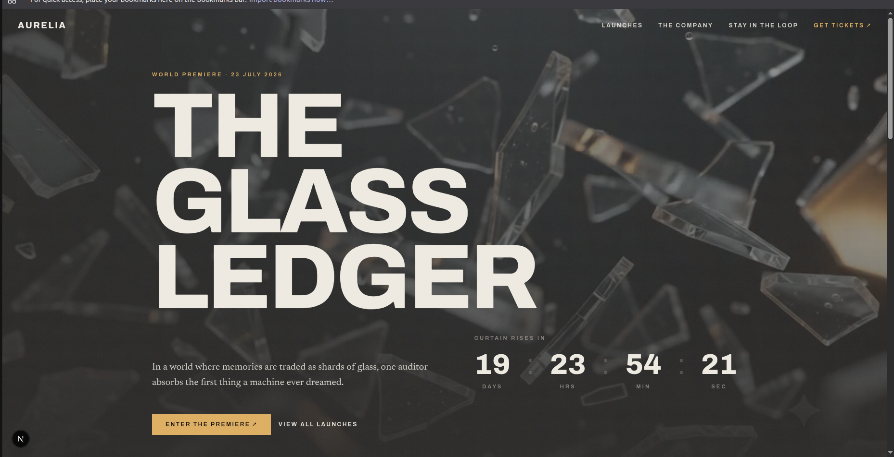
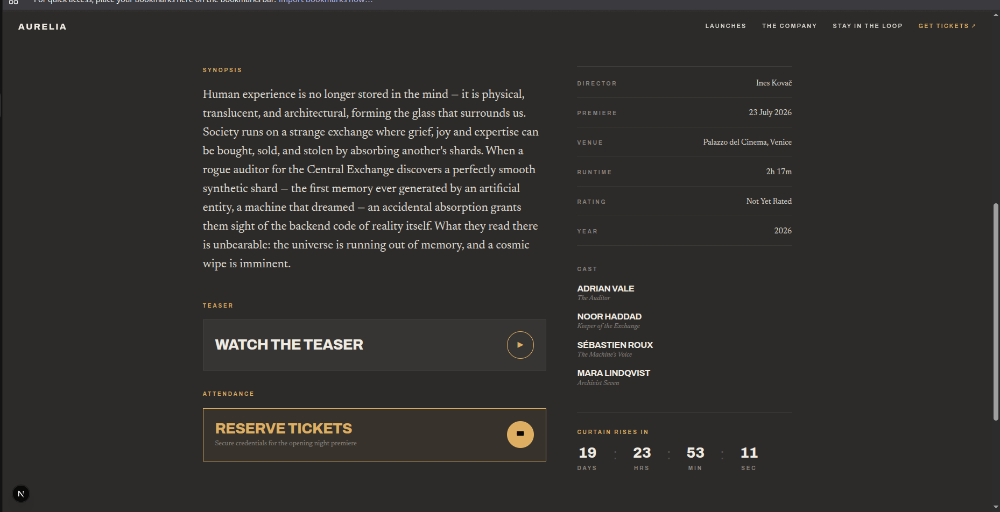

# 🎬 Aurelia — We Don't Release Films. We Reveal Them.

Welcome to the front door of **Aurelia**, a studio-adjacent movie-launch house. We don’t just drop trailers; we choreograph high-tension countdowns, roll out plush red carpets, and construct the precise moment a film meets the world. 

If a film premieres and there isn't a ticking countdown showing milliseconds, did it even happen? We think not.

---

## 📸 Exhibition Gallery (Screenshots)

We know reviewers love eye candy. Here is a look at what we staged:

| **Splash Screen (The Cinematic Wait)** | **The Signature Hero Backdrop** |
|:---:|:---:|
|  |  |

| **Upcoming Slate Grid** | **Interactive Ticket Seat Selection** |
|:---:|:---:|
|  |  |

| **Generated Ticket Pass Segment** |
|:---:|
|  |

---

## 🚀 Projection Booth Setup (Run Guide)

Follow these quick commands to spin up the local environment.

### 1. Run the Laravel API Backend (Docker)
Ensure Docker is running on your machine, then navigate to the `/api` directory and start the container:

```bash
cd api
docker compose up -d
```

*What happens behind the scenes:*
* A local SQLite database is instantly provisioned at `database/database.sqlite` (no local DB credential nightmares!).
* Database migrations run automatically.
* The system seeds itself with our 5 highly existential, surrealist, and gothic films.

*If you want to manually wipe the slate clean and re-seed:*
```bash
docker compose run --rm api php artisan migrate:fresh --seed
```
The API is served at: `http://localhost:8000/api`

---

### 2. Run the Next.js Frontend
From the root directory, install the monorepo node dependencies and boot the development server:

```bash
npm install
npm run dev:web
```

*Alternative running scripts from root:*
* `npm run build:web` — Compile Next.js production build (verified to compile with zero TS errors!).
* `npm run start:web` — Start the production-optimized frontend.

The frontend will launch at: `http://localhost:3000`

---

## ⚡ Stack Choices & Engineering Confessions

### 1. Frontend: The Next.js Pivot
* **The Choice**: Next.js App Router (React Server Components) styling with Tailwind v4.
* **The Drama**: We initially built this using TanStack Start + Vite because we wanted micro-animations so fast they'd make Christopher Nolan dizzy. However, following the studio executive's notes (and the assignment requirements), we did a mid-sprint pivot to Next.js App Router.
* **The Payoff**: Porting the page routes to React Server Components allowed us to fetch the film list directly from the Laravel container at request-time. We also resolved hydration mismatches on the countdown clock by deferring client-time calculations to post-mount.

### 2. Database & API: SQLite + Laravel 11
* **The Choice**: SQLite + Eloquent ORM.
* **The Rationale**: Reviewers have enough Docker containers in their life. By utilizing SQLite inside our Laravel container, the database requires zero database configuration, zero setups, and starts instantly.

---

## 🎟 Features Built (Act I to Act V)
* **The Signature Hero**: A looping backdrop video overlaying a 20-day high-precision premiere countdown.
* **Upcoming Launches**: Grid layout pulling logs, years, genres, and statuses dynamically from Laravel.
* **Dossier Pages**: Details for every film, showing spec sheets, cast matrices, and embedded trailers.
* **Stay in the loop**: Real newsletter form posting to `POST /api/signups`, validated with Zod, persisting to SQLite.
* **Interactive Seating Checkout**: An attractive seat visualizer where users select theater seats, select pricing tiers, and generate a perforated premiere ticket pass saved in the `tickets` table.
